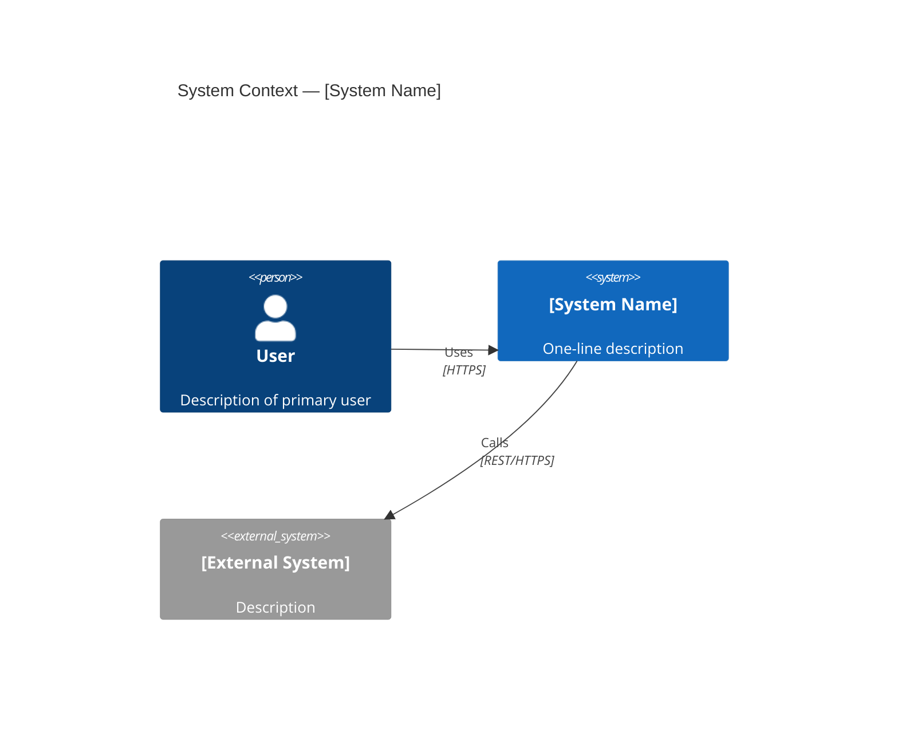

# [Talk Title]: [One-sentence value proposition]

**Speaker**: [Name, Role]
**Event / Audience**: [Conference / team / stakeholder group]
**Date**: [YYYY-MM-DD]
**Duration**: [30 / 45 / 60 min]

---

## Slide 1 — Title

**Title**: [Talk title]
**Subtitle**: [Concrete outcome or key finding]
**Speaker name, role, organisation**
**Date and event name**

*Speaker notes*: Open with the hook — a surprising statistic, a failure story, or a question the audience cannot immediately answer. Do not read the title slide aloud.

---

## Slide 2 — Agenda (optional for <30 min talks)

**Claim**: This talk covers three topics that together explain [outcome].

1. [Topic A] — [2-word description]
2. [Topic B] — [2-word description]
3. [Topic C] — [2-word description]

*Speaker notes*: Keep agenda brief. Audiences do not need to know every section — they need to know what problem you solve.

---

## Slide 3 — Problem / Context

**Claim**: [State the problem as a concrete, quantified fact]

Evidence:
- [Metric showing the problem exists, e.g. "P99 latency averages 1.2s; SLO is 400ms"]
- [Business or user impact, e.g. "3 SEV1 incidents in Q3 caused $120k in support cost"]
- [Root cause or contributing factor, e.g. "No circuit breakers — one downstream failure cascades"]

*Speaker notes*: Do not propose solutions yet. Let the problem breathe. Audiences need to feel the pain before they care about your answer.

---

## Slide 4 — Why This Problem Is Hard (optional)

**Claim**: [State why the obvious approach fails]

Evidence:
- [Constraint 1, e.g. "We cannot take the service offline — 99.5% uptime SLA"]
- [Constraint 2, e.g. "Distributed across 4 teams with independent release cycles"]
- [Previous attempt and why it was insufficient]

---

## Slide 5 — Solution Overview

**Claim**: [One sentence: what you built / did, and the headline result]

| What | [System or capability name] |
|------|-----------------------------|
| Approach | [2-sentence description] |
| Key result | [Headline metric delta] |
| Status | [Production / Pilot / Proposed] |

*Architecture diagram goes on the next slide — do not crowd this one.*

---

## Slide 6 — Architecture Diagram

**Claim**: [State what the diagram shows, e.g. "Three components isolate failure domains"]

*Replace with your actual diagram. Run `diagram_lint.py` before committing.*

*Speaker notes*: Walk the diagram left-to-right or top-to-bottom. Name each component before explaining its role. Pause for questions.

---

## Slide 7 — Deep Dive: [Key Technical Point 1]

**Claim**: [Specific technical assertion]

Evidence:
- [Code snippet, benchmark result, or architecture decision rationale]
- [Why alternative approaches were rejected]
- [Link to further reading if needed]

*Speaker notes*: This is where you earn technical credibility. Be specific. Quote line numbers or config values.

---

## Slide 8 — Deep Dive: [Key Technical Point 2]

**Claim**: [Specific technical assertion]

Evidence:
- [...]
- [...]

---

## Slide 9 — Demo

**Claim**: [What the audience will see demonstrated]

Demo script:
1. [Step 1 — what you navigate to / run]
2. [Step 2 — what you show]
3. [Step 3 — what you highlight as evidence of the claim]

**Fallback**: *If live demo fails, switch to `demo-screenshots.pdf` in the appendix.*

*Speaker notes*: Always narrate what is happening on screen. Silence during a demo makes the audience anxious.

---

## Slide 10 — Metrics / Results

**Claim**: [State the quantified outcome]

| Metric | Before | After | Change |
|--------|--------|-------|--------|
| P99 latency | [X ms] | [Y ms] | [−Z%] |
| Error rate | [X%] | [Y%] | [−Z%] |
| Resilience score | [X/100] | [Y/100] | [+Z pts] |
| MTTR | [X min] | [Y min] | [−Z%] |

*Note: Data from [environment], [date range], [sample size]. Confidence interval: [±Z%].*

---

## Slide 11 — Risks and Mitigations

**Claim**: [State that risks are understood and managed]

| Risk | Likelihood | Impact | Mitigation |
|------|-----------|--------|------------|
| [Risk 1] | Medium | High | [Specific control] |
| [Risk 2] | Low | Medium | [Specific control] |
| [Risk 3] | High | Low | [Specific control] |

*Speaker notes*: Address risks proactively. If an audience member raises a risk you haven't listed, acknowledge it and commit to a follow-up — never dismiss it.*

---

## Slide 12 — Takeaways

**Claim**: Three things to remember from this talk

1. **[Takeaway 1]** — [One sentence elaboration]
2. **[Takeaway 2]** — [One sentence elaboration]
3. **[Takeaway 3]** — [One sentence elaboration]

*Speaker notes*: These should mirror the three most important things you said. If you could only send one slide, this would be it.*

---

## Slide 13 — Next Steps / CTA

**Claim**: [There are clear, specific next steps for each stakeholder]

| Audience | Action | Owner | By |
|----------|--------|-------|----|
| Engineering | [e.g. Run the baseline experiment on staging] | [Team] | [Date] |
| Product | [e.g. Approve error budget policy] | [Name] | [Date] |
| Executive | [e.g. Authorise Q4 chaos programme budget] | [Name] | [Date] |

---

## Slide 14 — Q&A

**Contact**: [email / Slack handle]
**Slides and links**: [URL or QR code]
**Recording**: [URL once published]

---

## Appendix

### A1 — Demo Screenshots (fallback)
[Attach screenshots here]

### A2 — Detailed Data Tables
[Full result tables with all metrics and confidence intervals]

### A3 — Related Work / Prior Art
[Links to related projects, papers, or internal docs]

### A4 — Glossary
| Term | Definition |
|------|-----------|
| SLO | Service Level Objective — a target value for an SLI |
| MTTR | Mean Time To Recovery |
| [Add terms] | [...] |
